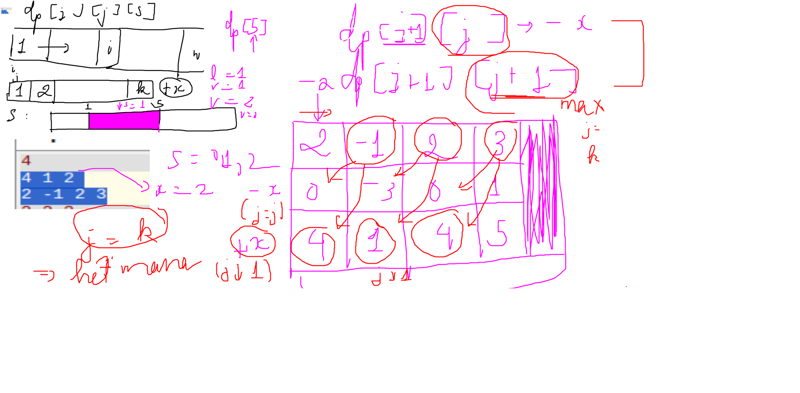

## 🧠 Mục tiêu bài toán (tóm tắt)

Chúng ta được cho một mảng `a` và hai số nguyên `k`, `x`.  
Phải chọn đúng `k` vị trí để **cộng thêm `x`**, các vị trí còn lại **trừ đi `x`**.  
Sau đó, tìm **tổng lớn nhất của một dãy con liên tiếp** trong mảng đã biến đổi.

---

## 🔁 Ý tưởng chính: Dùng Quy hoạch động (DP) 3D

Ta dùng bảng DP 3 chiều:

```cpp
dp[i][j][s]
```

Với:
- `i`: đã xử lý xong `i` phần tử đầu tiên
- `j`: đã dùng `j` phép toán cộng `x`
- `s`: trạng thái hiện tại của dãy con:
  - `s = 0`: chưa bắt đầu dãy con
  - `s = 1`: đang ở trong dãy con
  - `s = 2`: đã kết thúc dãy con

Mục tiêu: Tìm `max(dp[n][k][1], dp[n][k][2])` → tức là giá trị lớn nhất của dãy con khi đã xử lý hết mảng và dùng đúng `k` lần cộng `x`.

---

## 🔁 Vòng lặp chính và giải thích chi tiết

### ✅ Khởi tạo DP

```cpp
vector<vector<vector<ll>>> dp(n + 1, vector<vector<ll>>(k + 1, vector<ll>(3, -INF)));
dp[0][0][0] = 0;
```

> Đây là bước chuẩn bị ban đầu. Ta khởi tạo toàn bộ bảng `dp` với giá trị `-INF` (rất nhỏ), ngoại trừ `dp[0][0][0] = 0` — tức là không làm gì cả thì tổng là 0.

---

### ✅ Vòng lặp chính

```cpp
for (int i = 0; i < n; ++i) {
    for (int j = 0; j <= k; ++j) {
        for (int state = 0; state < 3; ++state) {
            if (dp[i][j][state] == -INF) continue;

            // Code xử lý từng trường hợp sẽ ở đây
        }
    }
}
```

> Vòng lặp này duyệt qua từng phần tử trong mảng (`i`) và từng trạng thái có thể (`j`, `state`). Nếu trạng thái `(i,j,state)` không khả thi (giá trị là `-INF`), bỏ qua.

---

## 🟢 Trường hợp 1: Trừ `x` khỏi phần tử hiện tại

```cpp
ll val_sub = a[i] - x;
for (int next_state = state; next_state < 3; ++next_state) {
    dp[i + 1][j][next_state] = max(
        dp[i + 1][j][next_state],
        dp[i][j][state] + (next_state == 1 ? val_sub : 0)
    );
}
```

> ❓ **Giải thích:**
- Ta **không dùng phép toán cộng `x`**, nên `j` giữ nguyên.
- Giá trị mới của phần tử là `a[i] - x`.
- Chỉ tính giá trị này vào tổng nếu ta đang ở trong dãy con (`next_state == 1`).
- Có thể chuyển từ trạng thái `state` sang bất kỳ trạng thái nào `>= state` (ví dụ: từ chưa bắt đầu → vẫn chưa bắt đầu hoặc bắt đầu).

---

## 🔵 Trường hợp 2: Cộng `x` vào phần tử hiện tại (nếu còn phép)

```cpp
if (j < k) {
    ll val_add = a[i] + x;
    for (int next_state = state; next_state < 3; ++next_state) {
        dp[i + 1][j + 1][next_state] = max(
            dp[i + 1][j + 1][next_state],
            dp[i][j][state] + (next_state == 1 ? val_add : 0)
        );
    }
}
```

> ❓ **Giải thích:**
- Chỉ thực hiện nếu còn phép cộng `x` (`j < k`)
- Giá trị mới của phần tử là `a[i] + x`
- Tăng số lần sử dụng lên: `j + 1`
- Cũng chỉ tính vào tổng nếu đang ở trong dãy con (`next_state == 1`)
- Giữ nguyên logic chuyển trạng thái như trước.

---

## 📌 Kết quả cuối cùng

```cpp
cout << max(dp[n][k][1], dp[n][k][2]) << '\n';
```

> Sau khi xử lý hết mảng (`i = n`), và đã dùng đúng `k` lần cộng `x`, chúng ta lấy giá trị lớn nhất giữa:
- `dp[n][k][1]`: đang ở trong dãy con
- `dp[n][k][2]`: đã kết thúc dãy con

---

## ✅ Ví dụ minh họa

**Input:**

```
1
4 1 2
2 -1 2 3
```

**Output:**

```
5
```

> Nghĩa là: chỉ được cộng `2` vào 1 vị trí, ví dụ chọn vị trí `0` → mảng thành `[4, -3, 0, 1]`. Dãy con lớn nhất là `[4]` → tổng là `5`.

---

## 📌 Tổng kết

| Phần | Giải thích |
|------|------------|
| `dp[i][j][s]` | Cập nhật trạng thái theo từng bước và theo từng trạng thái của dãy con |
| `val_sub` | Xử lý trường hợp trừ `x` |
| `val_add` | Xử lý trường hợp cộng `x` nếu còn phép |
| `next_state` | Quản lý việc bắt đầu / đang trong / kết thúc dãy con |
| `max(...)` | Luôn chọn giá trị tốt nhất |

---

Image explaination:
